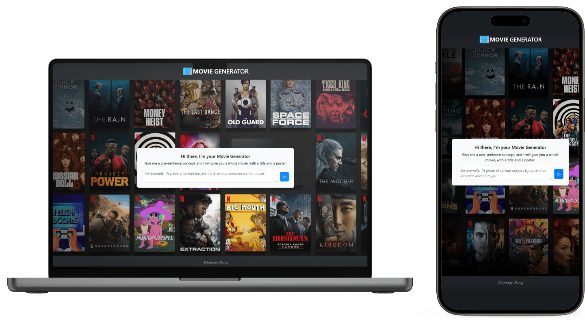
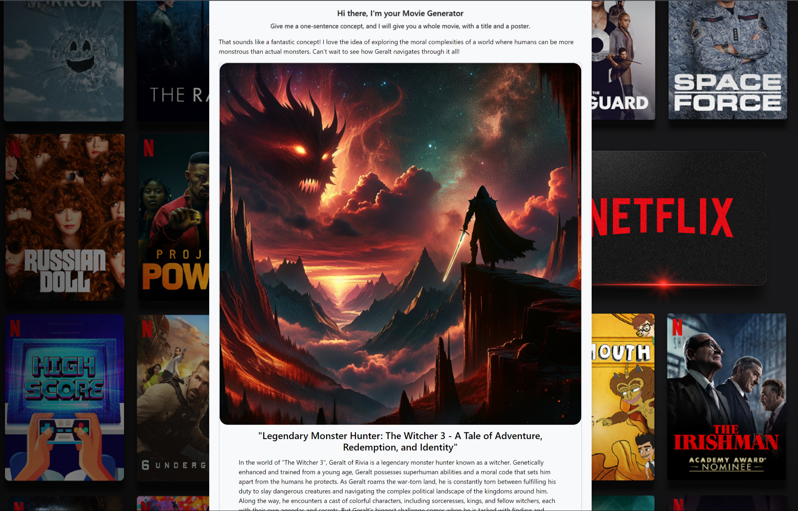

  
  
  

 

# Movie Generator

  

## Overview

This chatbot uses gpt-3.5-turbo and DALL·E 3 API to generate a movie plot, a title and a poster based on the prompt from which users have entered. The movie generator is fine tuned to tailor generating engaging, professional movie. Each movie is about 350 words long.

## Features

-   Type in a movie idea.
-   Generate a movie story based on the user input.
-   Generate a movie title.
-   Generate a movie poster.

## Screenshot

  

